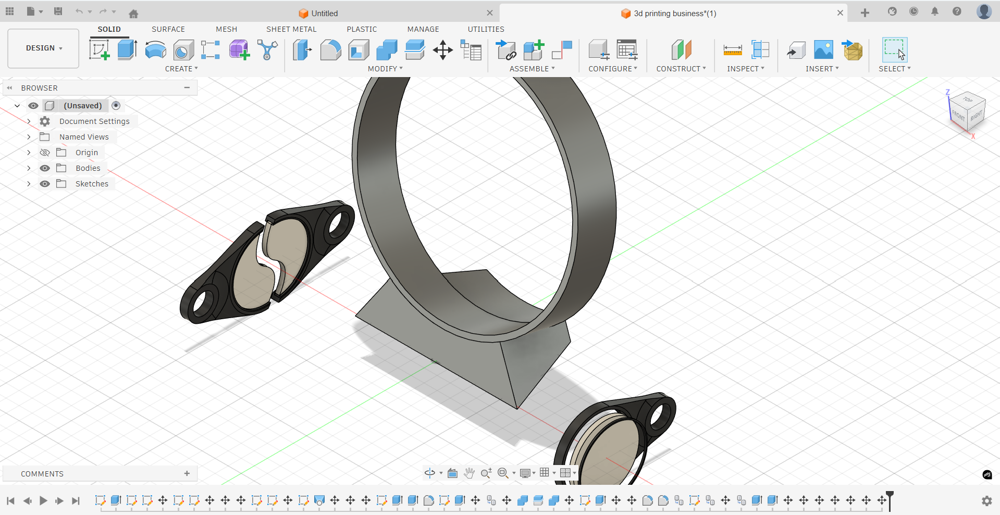

# 🔆 Lithophane Designs — Fusion 360

A collection of 3D-printable lithophane designs made in **Autodesk Fusion 360**. Each design is ready to export as STL and print with any standard FDM printer using translucent or white PLA/PETG filament.

---

---

## 📦 Designs

### 1. Standing Round Lithophane Lamp
> A lamp style lithophane designed to house a backlight — best used as a decorative lamp or night light.

**Suggested Use:** Desk lamp, bedside night light, gift item

**Print Settings:**
| Parameter | Recommended |
|-----------|-------------|
| Material | White / Natural PLA or PETG |
| Supports | None required |
---

### 2. Lithophane Keychain
> A compact single-image lithophane designed to be carried as a keychain.

**Features:**
- Small form factor optimized for portability
- Keyring hole integrated into the design
- Flat profile with beveled edges for durability
- Suitable for portrait photos, logos, or small artwork

**Suggested Use:** Personal keychain, memorial keepsake, custom gift

**Print Settings:**
| Parameter | Recommended |
|-----------|-------------|
| Material | White / Natural PLA |
| Supports | None required |

---

### 3. Couple Keychain (Matching Pair)
> A two-piece keychain set made of identical parts — designed as a couple's keepsake where both halves carry the same or complementary image.

**Features:**
- Two identical parts printed from a single file (print × 2)
- Keyring holes on both pieces
- Uniform dimensions for a matching set aesthetic
- Can be used with the same image or mirrored/complementary images

**Suggested Use:** Couple keepsakes, BFF gifts, matching accessories

**Print Settings:**
| Parameter | Recommended |
|-----------|-------------|
| Material | White / Natural PLA |
| Supports | None required |
---

## 🛠️ How to Use

### Generating Your Lithophane Image
These designs use a **lithophane cutout/slot or emboss surface** in Fusion 360.  
To generate a lithophane from your own photo:

1. Use a lithophane generator tool such as:
   - [itslitho.com](https://itslitho.com)
   - [3dp.rocks/lithophane](https://3dp.rocks/lithophane)
2. Export the generated STL
3. Import it into Fusion 360 and align it with the provided base body
4. Export the final merged STL for printing

### File Format
All three designs are contained in a **single Fusion 360 file**:
- `.f3d` — Native Fusion 360 file with all designs as separate components/bodies

No pre-exported STL files are included. Export each design individually from Fusion 360 before slicing.

---

## 📁 Repository Structure

```
lithophane-designs/
│
├── lithophane_designs.f3d   ← All 3 designs in one file
└── README.md
```

---

## 🖨️ General Printing Tips

- Always use **white or natural (translucent) filament** — colored filament blocks light transmission
- A **0.4 mm nozzle** works well; **0.2 mm** gives finer detail for small keychains
- For the lamp, pair with a warm white LED (~2700K) for a cozy aesthetic
- Slow print speeds (~30–40 mm/s) improve surface quality on thin walls

---

## 📄 License

These designs are shared for **personal and non-commercial use**.  
Feel free to remix or adapt — a credit back to this repo is appreciated! 🙏

---

## 🤝 Contributing / Feedback

Have a variation idea or improvement? Open an issue or submit a pull request.  
Prints and results shared in issues are very welcome!

---

*Designed in Autodesk Fusion 360 · Made with ❤️ in Kerala, India*
